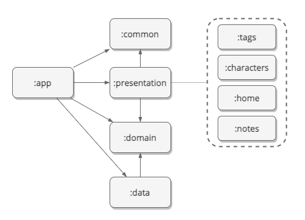
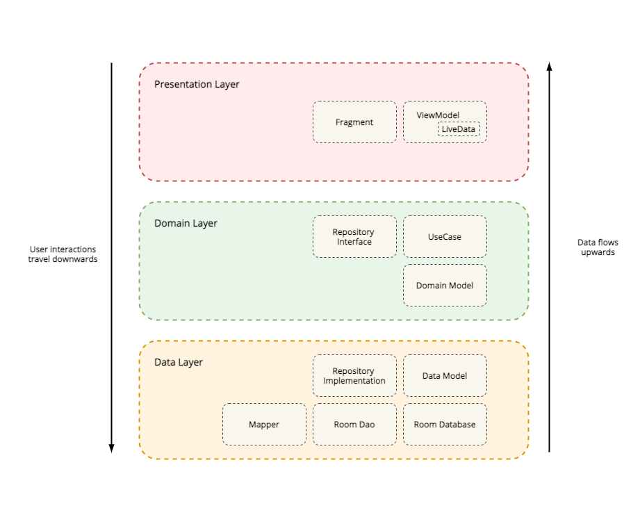

# Grimoire :crystal_ball: :open_book:
> ## What is this?
Grimoire (pronounced **gruhm · waar**) is a hobby app that employs several Android modern technologies and best practices.  
It is currently a work in progress being slowly improved weekend by weekend, for usage on my not-so-regular tabletop RPG gaming sessions.

> ## Summary
Built 100% with Kotlin, it has a [single-activity](app/src/main/java/com/peterkrauz/grimoire/MainActivity.kt) and performs navigation actions
with Jetpack's Navigation Component. Fragments and [ViewModel](https://developer.android.com/topic/libraries/architecture/viewmodel)s interact with one another
through the usage of [LiveData](https://developer.android.com/topic/libraries/architecture/livedata)s, employing a unidirectional data flow on our presentation layer.
All (or at least the majority) of this project's [library dependencies](buildSrc/src/main/java) were declared using Gradle's Kotlin DSL, which are located in a module (`:buildSrc`) of its own.
The focus is to display a modern multi-module design paired with a tidy architecture.

> ## Architecture
In search of achieving a [Clean Architecture](https://blog.cleancoder.com/uncle-bob/2012/08/13/the-clean-architecture.html), the common monolithic Android structure
was dismembered into multiple modules.

> ### Module Dependencies

I chose to have a separation by layer here. In doing so, `:domain` module will contain all UseCase classes of our app, no matter which presentation module it serves. Same goes for the `:data` module.
The only difference arises on the `:presentation` module, where each screen (and it's Fragments/States) were put into separate folders. 

> ### Layers

Using this layout, our Domain layer (which encompasses both Application + Enterprise business rules) is completely unaware of any other module - as intended. The Data layer needs only to depend on the Domain to provide concrete implementations of the Domain's components (Repository, Entity, etc).  
The Presentation layer depends on both of the aforementioned layers, since it is the third layer of our architecture, and thus our state-handling Presenters must be able to dispatch and call for state-changing Interactors.
Finally, we have an "extra" layer - the App - that knows of everything else. There we have our app's entry-point, as well as the configuration and components of the chosen [Dependency Injection](https://java-design-patterns.com/patterns/dependency-injection/) library.

> ## Technologies
* [Coroutines](https://developer.android.com/kotlin/coroutines)
* [Jetpack](https://developer.android.com/jetpack)
  * [Room](https://developer.android.com/topic/libraries/architecture/room)
  * [Hilt](https://developer.android.com/training/dependency-injection/hilt-android)
  * [Navigation](https://developer.android.com/guide/navigation)
  * [ViewModel](https://developer.android.com/topic/libraries/architecture/viewmodel)
* [Material Transform](https://material.io/develop/android/theming/motion)
* [ktlint](https://github.com/pinterest/ktlint)
